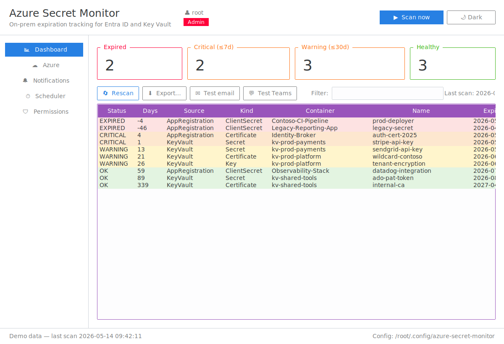
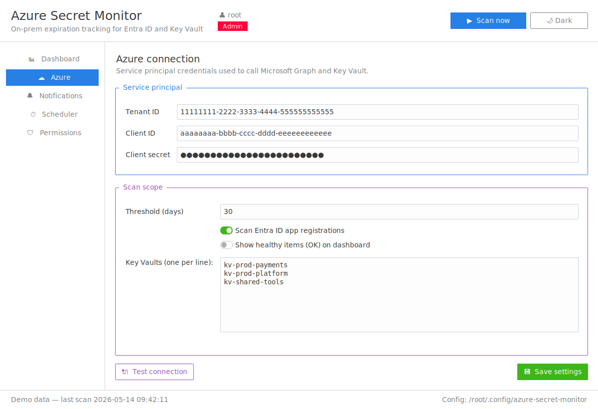
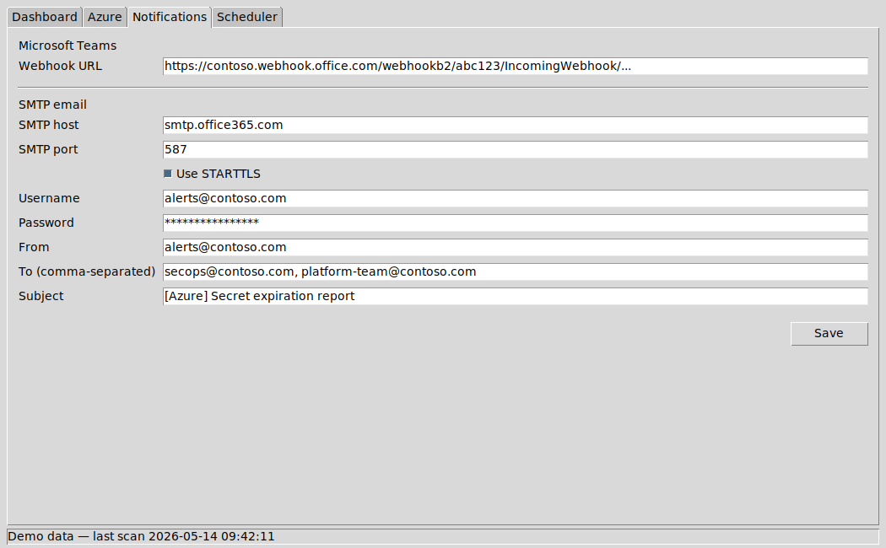
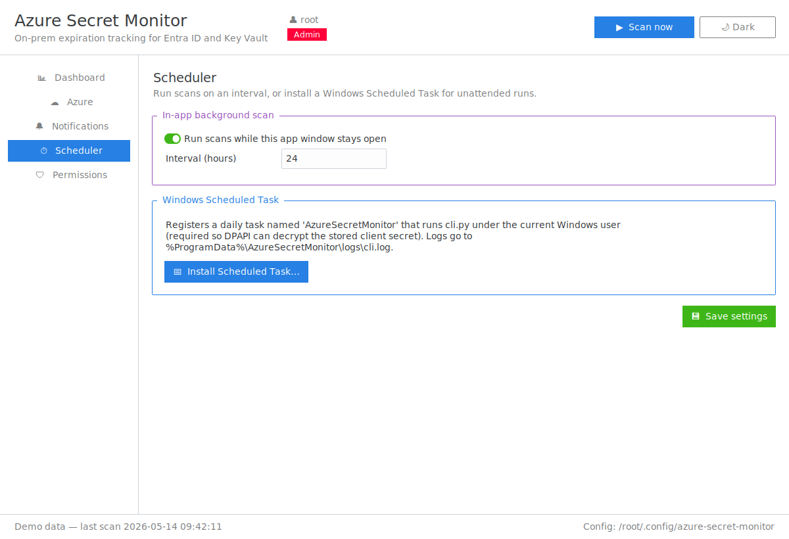
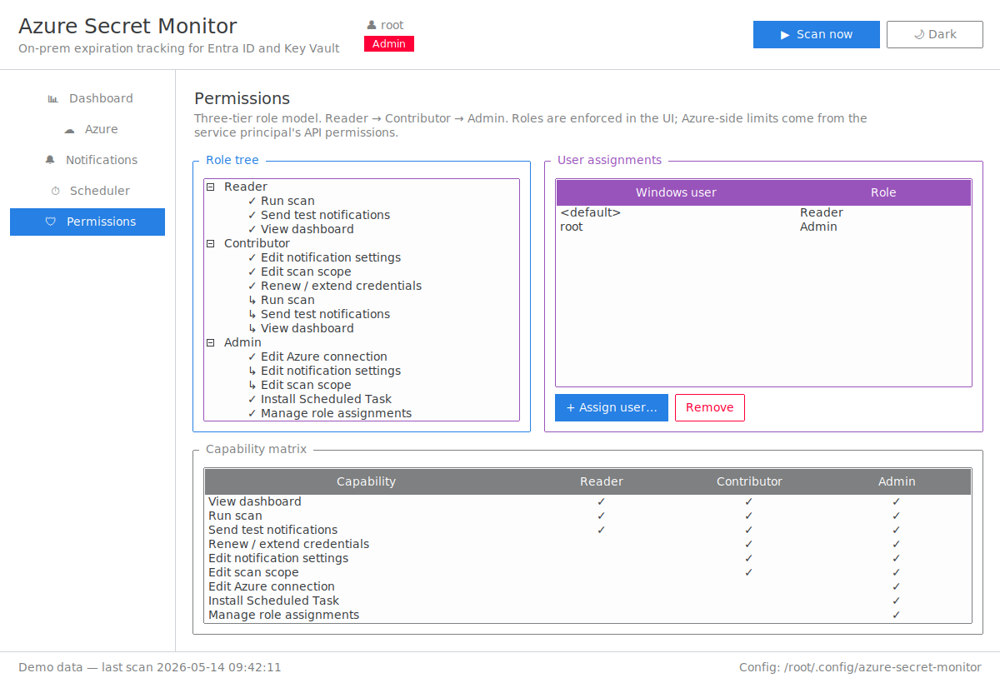

# Installation & Configuration Guide

End-to-end walkthrough for getting **Azure Secret Monitor** running on a
Windows Server, from a clean machine through your first notification.

> Estimated time: **20–30 minutes**, most of which is waiting for an Azure
> admin consent click.

---

## Table of contents

1. [What you'll end up with](#1-what-youll-end-up-with)
2. [Prerequisites](#2-prerequisites)
3. [Install Python on Windows Server](#3-install-python-on-windows-server)
4. [Get the code](#4-get-the-code)
5. [Install Python dependencies](#5-install-python-dependencies)
6. [Create the Entra ID app registration](#6-create-the-entra-id-app-registration)
7. [Grant Microsoft Graph permission](#7-grant-microsoft-graph-permission)
8. [Grant Key Vault permission](#8-grant-key-vault-permission)
9. [Launch the GUI and configure](#9-launch-the-gui-and-configure)
10. [Configure notifications](#10-configure-notifications)
11. [Run your first scan](#11-run-your-first-scan)
12. [Install the Windows Scheduled Task](#12-install-the-windows-scheduled-task)
13. [Verify everything works](#13-verify-everything-works)
14. [Role-based permissions](#14-role-based-permissions)
15. [Renewing / extending credentials](#15-renewing--extending-credentials)
16. [Troubleshooting](#16-troubleshooting)
17. [Appendix: file locations and exit codes](#17-appendix-file-locations-and-exit-codes)
18. [Security model & least-privilege checklist](#18-security-model--least-privilege-checklist)
19. [Building EXE / MSI from source](#19-building-exe--msi-from-source)

---

## 1. What you'll end up with

- A GUI app on the server's desktop for ad-hoc scans and configuration.
- A Windows Scheduled Task that runs `cli.py` every day under your user
  account, decrypts the stored client secret with DPAPI, hits Azure, and
  posts/emails any items whose severity rose since the last run.
- A JSON state file that prevents the same alert from firing every day.



---

## 2. Prerequisites

- **Windows Server 2019 / 2022 / 2025** (or Windows 10/11 — the app is just
  a desktop Python program).
- **Local admin** on the server (only needed once, to register the Scheduled
  Task; the task itself runs as your normal user).
- **Outbound HTTPS** from the server to:
  - `login.microsoftonline.com`
  - `graph.microsoft.com`
  - `*.vault.azure.net`
  - your Teams webhook host (`*.webhook.office.com`) and/or SMTP relay
- **An Entra ID tenant admin** who can grant `Application.Read.All` consent
  (one click in the portal — the rest you can do yourself).

---

## 3. Install Python on Windows Server

1. Sign in to the server as the user that will own the monitor (e.g.
   `CONTOSO\svc-secret-monitor`). Important: that **same** account must run
   the Scheduled Task later, because DPAPI ties the encrypted secret to the
   user profile.
2. Download Python **3.11 or 3.12** for Windows (64-bit) from
   <https://www.python.org/downloads/windows/>.
3. Run the installer:
   - Tick **"Add python.exe to PATH"**.
   - Click **"Customize installation"** and keep `tcl/tk and IDLE` selected
     (this is tkinter — required for the GUI).
   - Finish the wizard.
4. Open a new PowerShell window and verify:

   ```powershell
   python --version       # 3.11.x or 3.12.x
   python -c "import tkinter; print('tk OK')"
   ```

---

## 4. Get the code

You have three options. Pick one.

### A. Install the prebuilt MSI *(easiest, recommended for production)*

Download `AzureSecretMonitor.msi` from the latest GitHub Release and
double-click it. The installer:

- Drops both EXEs in `C:\Program Files\AzureSecretMonitor\`.
- Creates a Start Menu shortcut to "Azure Secret Monitor".
- Runs `Initialize-Permissions.ps1` automatically (section 8a) so the
  machine-wide role store has its least-privilege ACL from day one.
- Registers itself in Add/Remove Programs for clean uninstall.

If you go this path, skip sections 5 and 8a — they're already done.

### B. Run the standalone EXE *(no installer, no Python required)*

Download `AzureSecretMonitor.exe` from the same release and put it
anywhere. Useful for one-off scans on a server you don't want to install
software on. You'll need to run `Initialize-Permissions.ps1` manually
(section 8a) if you want the role store and audit log.

### C. Clone and run from source *(developers)*

```powershell
cd C:\
git clone https://github.com/netanelmeg/Netanel_new.git AzureSecretMonitor
cd C:\AzureSecretMonitor
```

Continue with sections 5 → 13.

---

## 5. Install Python dependencies

```powershell
cd C:\AzureSecretMonitor\python
python -m pip install --upgrade pip
python -m pip install -r requirements.txt
```

This pulls `azure-identity`, the Key Vault SDKs, `msgraph-core`, `requests`,
and `ttkbootstrap` (the modern Tk theme). About 60 MB total.

---

## 6. Create the Entra ID app registration

1. Open the **Azure portal** → **Microsoft Entra ID** → **App registrations**
   → **+ New registration**.
2. Name it `azure-secret-monitor`. Single tenant. Leave the Redirect URI
   blank. Click **Register**.
3. On the new app's overview page, copy:
   - **Directory (tenant) ID**
   - **Application (client) ID**
4. Left nav → **Certificates & secrets** → **Client secrets** → **+ New
   client secret**. Description `secret-monitor`, expiry e.g. 24 months.
   Click **Add**. **Copy the value immediately** — it's only shown once.

Keep those three values handy: **tenant ID**, **client ID**, **secret value**.

---

## 7. Grant Microsoft Graph permission

The app needs to list all application registrations and read their
credentials. If you intend to also **renew** app-registration secrets from
inside the GUI, grant one of the write permissions below as well.

1. Left nav → **API permissions** → **+ Add a permission** →
   **Microsoft Graph** → **Application permissions**.
2. Tick the permissions you want:

   | Permission | Required for |
   |---|---|
   | `Application.Read.All` | Read-only monitoring (always required). |
   | `Application.ReadWrite.OwnedBy` | Renewing client secrets on app registrations the SP owns (recommended). |
   | `Application.ReadWrite.All` | Renewing client secrets on **any** app in the tenant (broader, riskier). |

3. Click **Add permissions**.
4. Click **Grant admin consent for <your tenant>** (a tenant admin must do
   this once). The status should turn green.

> Grant only what you'll actually use. If nobody on the team should be able
> to issue new app-registration secrets from this tool, skip the
> `ReadWrite` permissions entirely — the local **Contributor** role will
> still attempt the call but Azure will reject it (and the rejection is
> recorded in the audit log).

---

## 8. Grant Key Vault permission

Do this for **each** Key Vault you want monitored. The simplest path is RBAC.

### Read-only (monitoring only)

1. Open the Key Vault → **Access control (IAM)** → **+ Add role assignment**.
2. Assign **Key Vault Reader** to the service principal `azure-secret-monitor`.
3. Repeat and assign the data-plane reader roles:
   - **Key Vault Secrets User**
   - **Key Vault Crypto User**
   - **Key Vault Certificate User**

### Read + renew (extend expiries from inside the GUI)

Additionally assign the matching **officer** roles for the item types you
want to be able to renew:

| To renew… | Add this role |
|---|---|
| Secrets   | **Key Vault Secrets Officer** |
| Keys      | **Key Vault Crypto Officer** |
| Certificates | **Key Vault Certificates Officer** |

> Access-policy mode: grant `Get` + `List` + `Update` on the corresponding
> item types instead.

---

## 8a. Initialize machine-wide permissions (one-time)

The role assignments file and the audit log live in `%ProgramData%\AzureSecretMonitor\`
on purpose — anything per-user could be edited by the user and bypass the
role model. Run this **once, as an Administrator**, before the first GUI
launch:

```powershell
cd C:\AzureSecretMonitor\windows
powershell -ExecutionPolicy Bypass -File .\Initialize-Permissions.ps1
```

It creates the directory, drops a default `roles.json` (`{"*": "reader"}`),
and sets ACLs:

- `roles.json` — read by everyone, write by **Administrators only**
- `logs\audit.log` — append by anyone running the app, read by all,
  full control to Administrators

After this runs once, normal users launching the GUI get the **Reader**
role until an Administrator promotes them.

## 9. Launch the GUI and configure

Double-click `windows\Start-Monitor.bat`, or:

```powershell
cd C:\AzureSecretMonitor\python
python gui.py
```

Go to the **Azure** tab:



Fill in:

| Field | Value |
|---|---|
| Tenant ID | the GUID from step 6 |
| Client ID | the GUID from step 6 |
| Client secret | the secret value you copied in step 6 |
| Threshold (days) | how many days ahead to consider "expiring soon" — 30 is a good default |
| Scan Entra ID app registrations | ON if you want app-reg credentials reported |
| Show healthy items (OK) | OFF for normal monitoring; ON if you want a full inventory |
| Key Vaults | one vault **name** per line (not the full URL) |

Click **💾 Save settings**. The client secret is immediately encrypted with
Windows DPAPI under your current user and written to
`%APPDATA%\AzureSecretMonitor\secret.bin`. Nothing sensitive is stored in
plaintext on disk.

### Verify with "Test connection"

Click **🔌 Test connection** to run a quick pre-flight: it acquires a
token, makes one Graph call, and lists one secret from each configured
vault. The result modal shows a PASS/FAIL badge per check so you can
diagnose permission gaps before running a real scan. Common failures:

| Failure | Likely cause |
|---|---|
| Token acquisition fails | Wrong tenant/client ID, or the client secret expired or was mistyped. |
| Graph call fails (403) | `Application.Read.All` not granted, or admin consent missing. |
| A specific Key Vault fails (403) | The SP doesn't have `Key Vault Secrets User` on that vault. |

---

## 10. Configure notifications

Go to the **Notifications** tab:



### Microsoft Teams (optional)

1. In Teams, open the channel → ⋯ → **Workflows** (or **Connectors** in
   classic Teams) → add an **Incoming Webhook**.
2. Copy the generated URL into **Incoming webhook URL**.
3. Click **💾 Save settings**.
4. Back on the **Dashboard** tab, click **💬 Test Teams** — you should see a
   "No Azure secrets expiring within the threshold." card appear in Teams.

### SMTP email (optional)

| Field | Example |
|---|---|
| SMTP host | `smtp.office365.com` |
| SMTP port | `587` |
| Use STARTTLS | ON for 587, OFF for 465-with-implicit-TLS |
| Username | `alerts@contoso.com` |
| Password | the mailbox/relay password (encrypted with DPAPI on save) |
| From | `alerts@contoso.com` |
| To | comma-separated recipients (`secops@contoso.com, oncall@contoso.com`) |
| Subject | `[Azure] Secret expiration report` |

Save, then click **✉ Test email** on the Dashboard.

---

## 11. Run your first scan

Open the **Dashboard** tab and click **▶ Scan now** (top-right) or
**🔄 Rescan**. Within a few seconds you should see populated rows and the
status counters update:


- The colored cards across the top show how many credentials fall in each
  bucket.
- Each row's left column is its severity (`EXPIRED`, `CRITICAL`, `WARNING`,
  or `OK`).
- Use the **Filter** box to narrow down by name / vault / kind.
- **⬇ Export…** writes the currently-visible rows (post-filter) to either
  CSV (Excel-friendly) or JSON (machine-readable), useful for opening
  tickets or feeding the report into spreadsheets. Exports are recorded
  in `audit.log`.

If the configured notification channels are set up, **rising-severity items
are sent automatically** during this same scan — but only items whose
severity is higher than the last recorded state. A clean follow-up scan will
not re-spam.

---

## 12. Install the Windows Scheduled Task

This lets the scanner run daily without keeping the GUI open.

### From inside the GUI

Open **Scheduler** → **📅 Install Scheduled Task…**:



A PowerShell window opens. Approve any UAC prompt. The task is registered
under the name `AzureSecretMonitor`, daily at 08:00 local time, running as
the current Windows user.

### Or from PowerShell directly

```powershell
cd C:\AzureSecretMonitor\windows
powershell -ExecutionPolicy Bypass -File .\Install-ScheduledTask.ps1 -Time 07:30
```

Useful flags:

| Flag | Purpose |
|---|---|
| `-Time HH:mm` | When the task runs daily (default `08:00`). |
| `-PythonPath C:\Python312\python.exe` | Pin a specific interpreter. |
| `-TaskName MyMonitor` | Override the task name. |

> The task **must** run as the same Windows user that saved settings in the
> GUI — DPAPI keys are profile-bound. If you switch users, save settings
> again under the new account.

Verify the task in **Task Scheduler** → **Task Scheduler Library** →
`AzureSecretMonitor`. Right-click → **Run** to fire it immediately.

Output is appended to `C:\ProgramData\AzureSecretMonitor\logs\cli.log`.

---

## 13. Verify everything works

```powershell
cd C:\AzureSecretMonitor\python
python cli.py --dry-run
```

You should see a status table printed to the console. Exit code:

| Code | Meaning |
|---|---|
| `0` | Clean — nothing in the threshold window |
| `1` | At least one item is in the window but not yet expired |
| `2` | At least one item is **already expired** |
| `3` | Config missing — re-open the GUI and save |

Then run a real scan (notifications enabled):

```powershell
python cli.py
type C:\ProgramData\AzureSecretMonitor\logs\cli.log
```

Confirm a Teams card and/or email arrived.

---

## 14. Role-based permissions

The GUI enforces a three-tier role model on top of Azure's own permissions.
Open the **🛡 Permissions** page in the sidebar.



| Role | Sees | Can change | Typical user |
|---|---|---|---|
| **Reader** | Dashboard, scans, settings (read-only) | Send test notifications | On-call viewers, auditors |
| **Contributor** | Reader + can renew/extend credentials | Edit notification and scan-scope settings | Platform engineers |
| **Admin** | Contributor + Azure connection + Scheduled Task + role management | Everything | Security / IAM owners |

Roles are inherited — Admin gets all of Contributor's powers and so on.

### Bootstrapping

The first **Windows Administrator** who launches the GUI is auto-promoted to
**Admin** in the app, so the install isn't unmanageable. Non-admin users
remain Reader until an Admin promotes them. This requires
`Initialize-Permissions.ps1` to have been run once (section 8a).

### Adding / changing users

1. On the Permissions tab, click **+ Assign user…**.
2. Type the Windows username (the local `SAMAccountName`, case-insensitive)
   or `*` to change the default for everyone not explicitly listed.
3. Pick the role, click **Assign**.

Removing a user falls them back to the `*` (default) role.

### Where it lives

Role assignments are stored at `%ProgramData%\AzureSecretMonitor\roles.json`,
ACL-restricted by `Initialize-Permissions.ps1` so only Windows
Administrators can write to it. This means a non-admin user cannot promote
themselves by editing their own profile.

The hierarchy is layered defense:

1. **NTFS ACL** on `roles.json` (Administrators-only writable)
2. **GUI role check** before showing destructive controls
3. **Service principal** Azure permissions (the only thing enforced server-side)

### Audit log

Every role change, settings save, and credential renewal is appended as a
JSON line to:

```
%ProgramData%\AzureSecretMonitor\logs\audit.log
```

Each record: timestamp, Windows user, role, action, target, success
flag, and a short detail string. Ship that file to your SIEM if you need
central audit.

---

## 15. Renewing / extending credentials

> Requires the **Contributor** role (or higher) and the Azure write
> permissions from sections 7–8.

1. Right-click any row on the Dashboard (or double-click).
2. The **Renew / extend** dialog opens for that credential.

### App registration client secrets

- A new client secret is **created** on the app registration via
  `POST /applications/{id}/addPassword`. Azure returns the value once; the
  GUI shows it in a one-shot "Copy to clipboard" modal.
- The **old** secret is intentionally left in place — rotate the consuming
  service to the new value first, then remove the old one in the Azure
  portal once you've confirmed nothing is using it.

### Key Vault items

- For a **secret** / **key** / **certificate**, the dialog updates the
  `expires_on` property on the existing version. The underlying secret
  material is unchanged.
- If the secret value itself is compromised, rotate it in the portal first,
  then re-bump the expiry here.

### Audit

Every renewal call writes one line to `audit.log` whether it succeeded or
failed (with the Azure error message in `detail`). If a Contributor
attempts a renewal but the SP doesn't have the matching write role, the
call fails on Azure's side and is recorded.

---

## 16. Troubleshooting

| Symptom | Fix |
|---|---|
| **GUI doesn't start, `ModuleNotFoundError: tkinter`** | Re-run the Python installer and tick "tcl/tk and IDLE". |
| **`AADSTS7000215: Invalid client secret`** | The secret in the GUI doesn't match the one in Entra ID, or it expired. Generate a new client secret and paste the **value** (not the secret ID). |
| **Graph 403 on `/applications`** | `Application.Read.All` is missing or admin consent wasn't granted. Re-check step 7. |
| **Key Vault 403** | Role assignment hasn't propagated, or wrong vault name. Wait 5 min and retry; double-check the vault **name** (not URL) in the GUI. |
| **`Scheduled Task fails with exit code 3`** | The task is running as a user who never saved settings. Either run the GUI under that user once, or re-register the task under the user who has the config. |
| **`CryptUnprotectData failed`** in the log | The DPAPI blob can't be decrypted by the current user — same root cause as above. |
| **No Teams card** | The webhook URL changed. Reconfigure with a fresh URL and retry **Test Teams**. |
| **SMTP `auth failed`** | Office 365 requires either SMTP AUTH explicitly enabled on the mailbox or a high-trust relay. Try a dedicated relay account. |
| **Same item alerts every day** | `state.json` was deleted or the item bounced between severities. Either accept it or raise the threshold so the item stays in one bucket. |

Increase verbosity by running:

```powershell
python cli.py -v
```

---

## 17. Appendix: file locations and exit codes

### File layout

```
C:\AzureSecretMonitor\
  python\
    gui.py            # GUI entry point
    cli.py            # headless run (used by Scheduled Task)
    core.py           # scanning + notification logic
    config_store.py   # DPAPI config storage
    requirements.txt
  windows\
    Start-Monitor.bat
    Install-ScheduledTask.ps1
  powershell\
    Monitor-AzureSecrets.ps1   # pure-PowerShell alternative
```

### Runtime data

```
%APPDATA%\AzureSecretMonitor\           # per-user
  config.json     non-sensitive settings
  secret.bin      client secret, DPAPI-encrypted
  smtp.bin        SMTP password, DPAPI-encrypted
  state.json      last-notified severity per item
  roles.json      Windows user → role assignments

%ProgramData%\AzureSecretMonitor\logs\  # machine-wide
  cli.log         Scheduled Task output
  audit.log       role changes + credential renewals (JSON lines)
```

### CLI flags

```
python cli.py [--dry-run] [--json] [--ignore-state] [-v]
```

| Flag | Effect |
|---|---|
| `--dry-run` | Print results, skip all notifications. |
| `--json` | Emit JSON instead of a table (good for piping into other tools). |
| `--ignore-state` | Notify on every matching item, regardless of last-notified state. |
| `-v` / `--verbose` | DEBUG logging. |

### Uninstall

```powershell
Unregister-ScheduledTask -TaskName AzureSecretMonitor -Confirm:$false
Remove-Item -Recurse "$env:APPDATA\AzureSecretMonitor"
Remove-Item -Recurse "$env:ProgramData\AzureSecretMonitor"
Remove-Item -Recurse C:\AzureSecretMonitor
```

And, in Entra ID, delete the client secret (and optionally the whole app
registration) to revoke access.

---

## 18. Security model & least-privilege checklist

| Layer | What enforces it | What to grant |
|---|---|---|
| **Azure scan (read)** | Service principal API permissions | Graph `Application.Read.All`; KV roles **Reader + Secrets/Crypto/Certificate User** |
| **Azure renew (write)** | Service principal API permissions | Graph `Application.ReadWrite.OwnedBy` *(preferred over `.All`)*; KV **Officer** roles **only** for item types you want renewable |
| **Local UI gating** | `permissions.py` role check | Local Windows account assigned to Reader/Contributor/Admin |
| **Role-file integrity** | NTFS ACL on `%ProgramData%\AzureSecretMonitor\roles.json` | Admin via `Initialize-Permissions.ps1` |
| **Client-secret confidentiality** | Windows DPAPI (CurrentUser) | Per-user; secret is decryptable only by the user that saved it |
| **SMTP password** | Windows DPAPI (CurrentUser) | Same as above |
| **Audit log integrity** | NTFS ACL on `logs/audit.log` + length-bounded fields | Ship to a SIEM for tamper-evidence |

**Minimum-impact deployment** (read-only monitoring, no renewal):

- Service principal: only `Application.Read.All` + Key Vault read roles.
- Everyone is **Reader**. Don't run `Initialize-Permissions.ps1` if you
  don't need a writable role file at all — but you also won't get the audit log.

**Contributor-enabled deployment** (renewal allowed):

- Add `Application.ReadWrite.OwnedBy` to the SP — **not `.All`** unless you
  truly need to manage every app.
- Add KV Officer roles **only** for the item types you intend to renew.
- Promote a small number of platform engineers to **Contributor**.

**Admin-restricted deployment** (multi-team server):

- Keep all renewal scope on a separate SP used only by Admins.
- Restrict Contributor role to nobody (or the empty set).
- Run `Initialize-Permissions.ps1` so only Windows Administrators can
  even change role assignments.

### Notes on what the local roles do **not** protect

- A user with **local file-system Admin** rights can edit `roles.json` or
  the DPAPI blob's owning profile and effectively become Admin in the app.
  The whole machine is the trust boundary.
- A user with the **same Windows account** that saved the client secret can
  always decrypt it (DPAPI is profile-bound). Don't share Windows accounts.
- The service principal credentials themselves are the ultimate authority.
  Treat the SP secret like a vault root key: rotate periodically and limit
  who can read `%APPDATA%\AzureSecretMonitor\secret.bin`.

---

## 19. Building EXE / MSI from source

Two artifact types are supported, both produced from the same Python
source:

| Artifact | Purpose | Built by |
|---|---|---|
| `AzureSecretMonitor.exe` | Standalone windowed GUI; no Python required on target | PyInstaller |
| `AzureSecretMonitorCli.exe` | Standalone console CLI used by the Scheduled Task | PyInstaller |
| `AzureSecretMonitor.msi` | Per-machine installer with Start Menu shortcut and auto-`Initialize-Permissions.ps1` | WiX Toolset v3 |

### Prerequisites on the build machine

- Windows 10/11 or Windows Server (build must be on Windows — PyInstaller
  produces native binaries for the host OS).
- Python 3.11 or 3.12 with `tcl/tk and IDLE` ticked.
- For MSI only: [WiX Toolset v3](https://wixtoolset.org/releases/)
  installed and `candle.exe` / `light.exe` on `PATH`.

### Build the EXEs

```powershell
cd C:\AzureSecretMonitor\windows
powershell -ExecutionPolicy Bypass -File .\Build-Exe.ps1
```

Output: `dist\AzureSecretMonitor.exe` (≈ 50 MB, GUI) and
`dist\AzureSecretMonitorCli.exe` (≈ 40 MB, console). First run extracts
the bundled Python runtime to a temp dir; subsequent runs are cached and
fast.

The PyInstaller spec at `windows\AzureSecretMonitor.spec` includes the
helper PowerShell scripts as data files, so the "Install Scheduled Task"
button in the GUI keeps working from a frozen install.

### Build the MSI

```powershell
cd C:\AzureSecretMonitor\windows
powershell -ExecutionPolicy Bypass -File .\Build-Msi.ps1 -Version 1.0.0.0
```

Output: `dist\AzureSecretMonitor.msi`. The script:

1. Calls `Build-Exe.ps1` first (use `-SkipExeBuild` to reuse existing
   binaries).
2. Runs `candle.exe` to compile `installer.wxs` against the version you
   supplied.
3. Runs `light.exe` to link the MSI with the WixUI minimal theme.

Version bumping: pass `-Version 1.2.0.0` for every release. The
`UpgradeCode` in `installer.wxs` is fixed, so MSIs with monotonically
increasing `ProductVersion` upgrade cleanly on top of older installs.

### Automated builds via GitHub Actions

`.github/workflows/build-release.yml` runs on every tag push matching
`v*` (and on-demand via the Actions tab). It:

1. Sets up Python on `windows-latest`.
2. Installs WiX via Chocolatey and adds it to `PATH`.
3. Runs `Build-Exe.ps1` and `Build-Msi.ps1`.
4. Uploads the three artifacts (`exe`, `cli`, `msi`) to the workflow run.
5. If the trigger was a `v*` tag, attaches them to the matching GitHub
   Release.

To cut a release:

```powershell
git tag v1.0.0
git push origin v1.0.0
```

Within 5 minutes the release page has both `AzureSecretMonitor.exe` and
`AzureSecretMonitor.msi` attached and ready to download.

### Signing (optional)

The build pipeline does **not** sign the binaries — your team is expected
to wrap signing into your release process. If you have a code-signing
certificate available, add a `signtool.exe sign` step to
`Build-Exe.ps1` after PyInstaller and to `Build-Msi.ps1` after the MSI
is linked. SmartScreen reputation will benefit.

### Uninstalling the MSI

```powershell
# Add/Remove Programs OR:
msiexec /x "C:\path\to\AzureSecretMonitor.msi" /quiet
```

The MSI removes the Program Files folder and the Start Menu shortcut.
User config in `%APPDATA%` and machine-wide state in `%ProgramData%` are
left intact deliberately so re-installs preserve role assignments and
the audit log. Wipe them manually if you want a true clean slate
(commands in section 17 → Uninstall).
